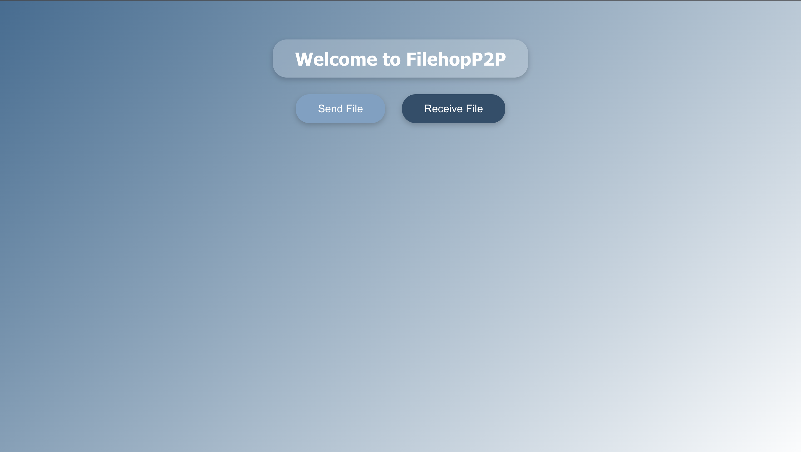
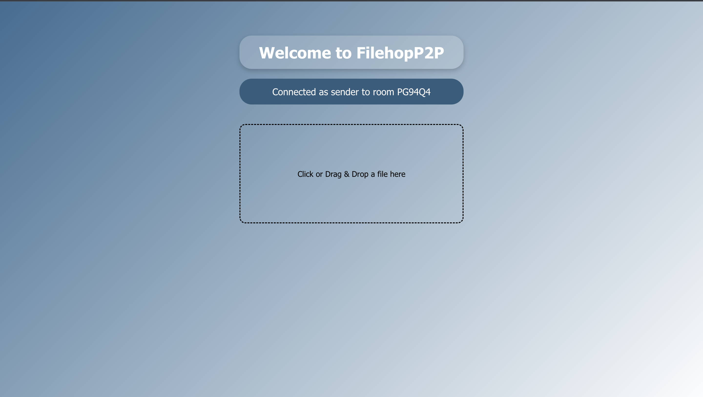
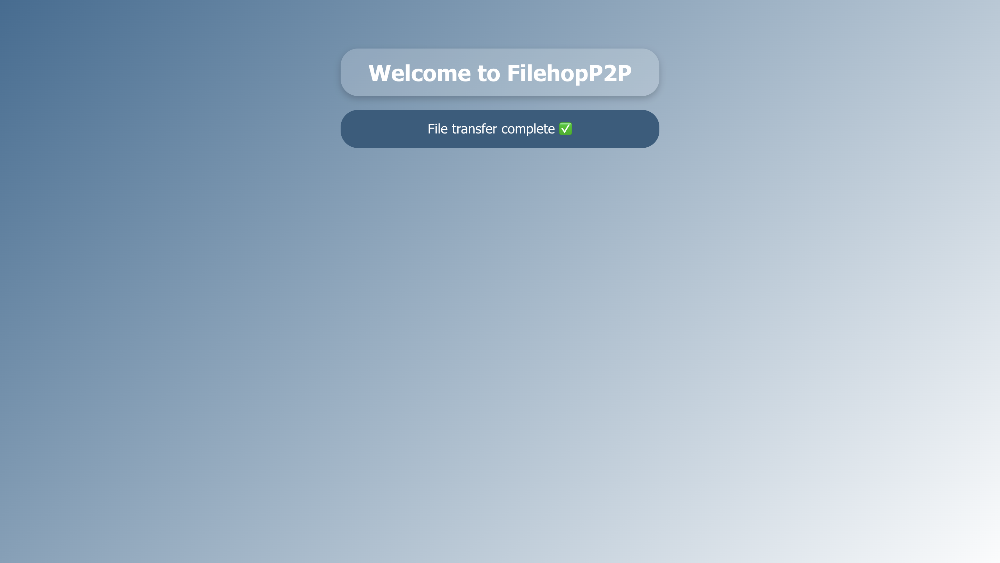
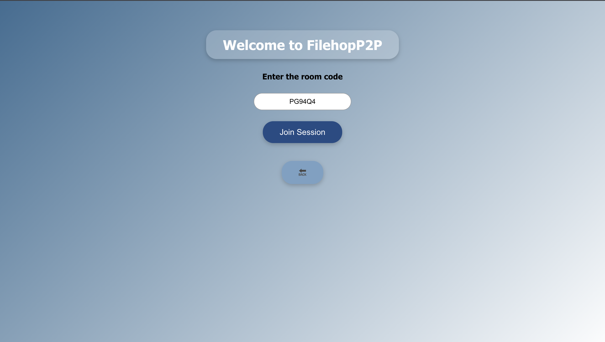

<!-- ## p2p filesharing web based application

- allows sender and receiver to join a room using a room code.
- utilise webrtc to transder file peer to peer. -->

## FileHopP2P
- A secure peer-to-peer (P2P) file sharing application built with WebRTC, React, and Node.js.
- It enables direct browser-to-browser encrypted file transfers with a custom WebSocket signaling server and TURN server for NAT traversal.

### Features
- **Encrypted File Sharing**: Transfers files directly between peers via WebRTC DataChannels, chunked for reliability.

- **Room-based Sessions**: Join a unique room ID as sender or receiver.

- **Custom TURN / STUN**: Uses your own TURN server (Coturn on AWS Lightsail) for robust NAT traversal.

- **Real-time Progress**: See transfer progress with intuitive UI.

### Deployable Frontend + Backend:
- Frontend on Vercel
- Backend WebSocket server on Railway
- TURN server on AWS Lightsail

### Tech Stack
- Frontend: React, simple UI for drag/drop upload and progress tracking
- Backend: Node.js with ws for WebSocket signaling
- P2P: WebRTC for direct encrypted file transfer
- TURN / STUN: Coturn server for NAT traversal

### Setup & Usage
- Backend (Signaling Server)
    Clone and install:
    ```
    git clone https://github.com/YOUR_USERNAME/FileHopP2P
    cd FileHopP2P/server
    npm install
    ```

    Run server locally:
    ```node index.js```
    By default runs on ws://localhost:8080.

    Or deploy on Railway / Render.

- Frontend (React)
    Install dependencies:
    ```
    cd ../client
    npm install
    ```
   Update your signaling server URL & TURN server config inside your React project (usually in src/webrtc.js or similar):
    ```
    const pc = new RTCPeerConnection({
        iceServers: [
            { urls: 'stun:stun.l.google.com:19302' },
            { urls: 'turn:YOUR_TURN_IP:3478', username: 'user', credential: 'pass' }
        ]
    });
    ```
    Run frontend:
    ```
    npm start
    Access on http://localhost:3000.
    ```

- TURN Server (Coturn on AWS Lightsail)
    Example /etc/turnserver.conf:
    ```
    listening-port=3478
    fingerprint
    lt-cred-mech
    use-auth-secret
    static-auth-secret=YOUR_SECRET
    realm=yourdomain.com
    total-quota=100
    bps-capacity=0
    log-file=/var/log/turnserver.log
    simple-log
    ```

    Start with:
    `sudo turnserver -c /etc/turnserver.conf`

- Screenshots
    Send File	Receiving File
    

    send file
    
    

    receive file
    
    <!--  -->
    

<!-- - Deployment Overview
    Frontend: Vercel → https://p2p-filesharing.vercel.app

    Backend: Railway → wss://your-backend.up.railway.app

TURN: AWS Lightsail → 13.201.xxx.xxx:3478 -->

<!-- 📜 License
MIT License.
Built with ❤️ for direct secure sharing. -->

